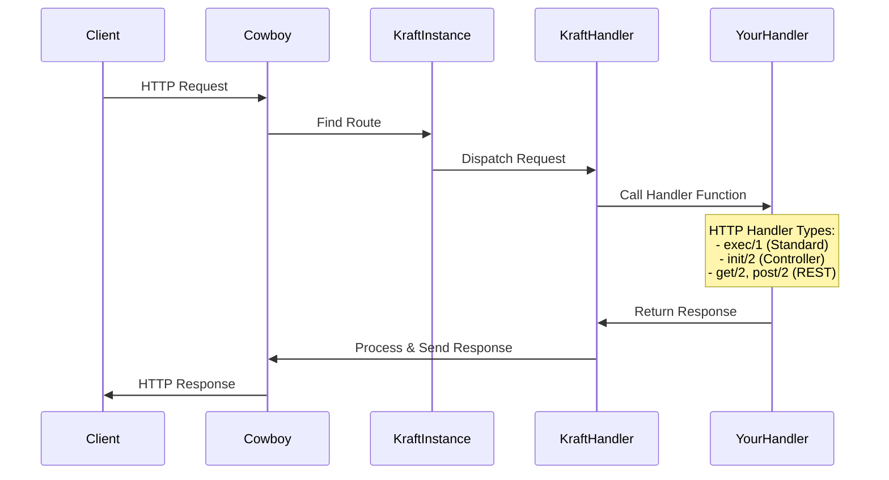

# Kraft

🧱 Kraft is a minimal web framework for Erlang.

Kraft acts as a middleware layer that handles all the complex HTTP routing,
WebSocket connections, request parsing, error management, response formatting,
and template rendering, while your handlers focus solely on implementing
domain-specific business logic without worrying about HTTP/WebSocket protocol
details.

Built on proven Erlang libraries like
[cowboy](https://github.com/ninenines/cowboy/tree/master) for HTTP/WebSocket
server, [cowlib](https://github.com/ninenines/cowlib) for protocol parsing,
[bbmustache](https://github.com/soranoba/bbmustache) for template rendering,
and [mapz](https://github.com/eproxus/mapz) for data manipulation, Kraft
provides a solid foundation for building robust web applications.

> 📎 **Note**: Check the minimum required OTP version `rebar.config`.

## Quick Start

Kraft includes many [examples](#examples), but in this guide we’ll start with a
simple REST setup:

1. Add the dependency to `rebar.config`:

    ```erlang
    {deps, [{kraft, "~> 0.2"}]}.
    ```

2. Create REST handler:

    ```erlang
    -module(users_handler).
    -behaviour(kraft_rest).
    -export([get/2, post/2, delete/2]).

    get([<<"users">>], Conn) ->
        Users = fetch_users(),
        {respond, Conn, {json, Users}}.

    post([<<"users">>], Conn) ->
        UserData = kraft_conn:body(Conn),
        NewUser = create_user(UserData),
        {respond, Conn, {json, NewUser, 201}}.

    delete([<<"users">>, UserId], Conn) ->
        delete_user(UserId),
        {respond, Conn, {status, 204}}.
    ```

3. Start server:

    ```erlang
    Routes = [
        {"/api/users", {http, users_handler, #{type => rest}}}
    ].
    kraft:start(#{port => 8080}, Routes).
    ```

4. Test your API:

    ```bash
    # Get users
    curl http://localhost:8080/api/users
    
    # Create user
    curl -X POST http://localhost:8080/api/users \
         -H "Content-Type: application/json" \
         -d '{"name": "John", "email": "john@example.com"}'
    
    # Delete user
    curl -X DELETE http://localhost:8080/api/users/123
    ```

## How it works?

First, we initialize Kraft with `kraft:start/2` using route definitions.
For more information on defining routes, see the documentation
for `t:kraft_instance:route_def/0`.

Once Kraft is initialized, there are tree main types of handlers of the requests:

### Kraft HTTP Handlers

The `m:kraft_handler` module creates a connection object and calls your specific
handler module, `YourHandler`. You only need to implement `YourHandler` logic -
Kraft handles all the HTTP infrastructure, routing, and response processing.

Here's how an HTTP request flows through the system:



**HTTP Handler Types:**

- **Standard Handler** (`m:kraft_handler` behaviour): Most flexible option,
  offering full control over request and response handling
- **Controller Handler** (`m:kraft_controller` behaviour) - Designed for
  template-based HTML page rendering
- **REST Handler** (`m:kraft_rest` behaviour) - Implements RESTful API endpoints
  with automatic HTTP method routing

### Kraft Websocket Handlers

Kraft does NOT provide generic WebSocket handlers. Instead, it provides
`m:kraft_ws_util`, which implements the `cowboy_websocket` behaviour.

The utils module is used by the specialized WebSocket modules
(`m:kraft_ws` for raw responses, `m:kraft_ws_json` for json responses,
`m:kraft_ws_jsonrpc` for json-rpc responses) who add protocol-specific
functionality so you can focus on your business logic instead of WebSocket
implementation details.

**WebSocket Types:**

- **`m:kraft_ws`**: Raw WebSocket handler for binary or text messages
- **`m:kraft_ws_json`**: JSON message handler with automatic parsing/encoding
- **`m:kraft_ws_jsonrpc`**: JSON-RPC 2.0 protocol handler for structured RPC
  calls

### Cowboy

Kraft allows you to use any Cowboy protocol or behaviour directly in your routes.
This is useful when you need specific Cowboy features, custom protocols, or want
to integrate existing Cowboy-based systems.

Cowboy comes with three main handler types you can use directly:

- [cowboy_rest](https://ninenines.eu/docs/en/cowboy/2.13/guide/rest_handlers/):
  For custom REST API implementations
- [cowboy_websocket](https://ninenines.eu/docs/en/cowboy/2.13/guide/ws_handlers/):
  For custom WebSocket handling
- [cowboy_loop](https://ninenines.eu/docs/en/cowboy/2.13/guide/loop_handlers/):
  For long-running operations

To use a Cowboy handler directly in your routes:

```erlang
Routes = [
    % Custom REST API endpoint
    {"/api/custom/:resource", {cowboy, your_rest_handler}, #{}},
    
    % Custom WebSocket endpoint
    {"/ws/custom", {cowboy, your_ws_handler}, #{}},
    
    % Long-running operation
    {"/long-task", {cowboy, your_loop_handler}, #{
        opts => #{idle_timeout => 60000}
    }}
].

kraft:start(#{port => 8080}, Routes).
```

Your handler module must implement the appropriate Cowboy behaviour.

## Examples

Explore kraft [examples](https://github.com/eproxus/kraft/tree/main/examples)
by downloading the repo and starting the example shell:

```sh
rebar3 as example shell
```

Then navigate to http://localhost:8090 to browse the available examples:

- 📝**Blog**: Template system with dynamic routing, layouts, partials, and
  ETS-based content storage.
- 💬 **Chat**: Real-time WebSocket chat with JSON handling and HTMX integration.
- 🎯**REST API**: JSON API with automatic HTTP method routing and form processing.
- ✅**Todo**: CRUD app with HTMX, persistent storage, and atomic operations.
- 🔌**WebSockets**: Raw, JSON, and JSON-RPC 2.0 protocol implementations with
  live demos for each protocol type.

## Documentation

📚 Generate searchable documentation using
[ex_doc](https://github.com/elixir-lang/ex_doc):

```bash
# Generate HTML documentation
rebar3 ex_doc

# Open in browser
open doc/index.html
```

## Development

### Code Formatting

📐 Kraft uses [erlfmt](https://github.com/WhatsApp/erlfmt) — the official Erlang
code formatter from WhatsApp — to ensure consistent code style across the
project.

Format your code using Rebar3:

```bash
# Format entire project
rebar3 fmt

# Format specific file
rebar3 fmt src/my_controller.erl

# Check formatting without applying changes (useful in CI)
rebar3 fmt --check
```

Enable the included Git pre-commit hook to automatically check code formatting:

```bash
git config core.hooksPath .githooks
```

This hook will validate your code formatting before each commit, ensuring code
quality.

---

*Need help? Browse the [examples](#examples) or the
[documentation](#documentation), or open an
[issue](https://github.com/eproxus/kraft/issues) on GitHub!*
