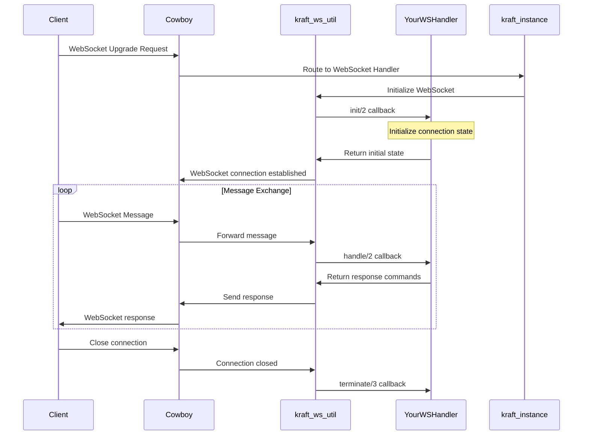

# Kraft

🧱 Kraft is a minimal web framework for Erlang.

Kraft acts as a middleware layer that handles all the complex HTTP routing,
WebSocket connections, request parsing, error management, response formatting,
and template rendering, while your handlers focus solely on implementing
domain-specific business logic without worrying about HTTP/WebSocket protocol
details.

Built on proven Erlang libraries like `cowboy` for HTTP/WebSocket server,
`cowlib` for protocol parsing, `bbmustache` for template rendering, and
`mapz` for data manipulation, Kraft provides a solid foundation for
building robust web applications.

> 📎 **Note**: Check the minimum required OTP version rebar.config.

## Quick Start (REST API example)

1. Add the dependency to `rebar.config`:

    ```erlang
    {deps, [{kraft, "~> 0.2"}]}.
    ```

2. Create REST handler:

    ```erlang
    -module(users_handler).
    -behaviour(kraft_rest).
    -export([get/2, post/2, delete/2]).

    get([<<"users">>], Conn) ->
        Users = fetch_users(),
        {respond, Conn, {json, Users}}.

    post([<<"users">>], Conn) ->
        UserData = kraft_conn:body(Conn),
        NewUser = create_user(UserData),
        {respond, Conn, {json, NewUser, 201}}.

    delete([<<"users">>, UserId], Conn) ->
        delete_user(UserId),
        {respond, Conn, {status, 204}}.
    ```

3. Start server:

    ```erlang
    Routes = [
        {"/api/users", {http, users_handler, #{type => rest}}}
    ].
    kraft:start(#{port => 8080}, Routes).
    ```

4. Test your API:

    ```bash
    # Get users
    curl http://localhost:8080/api/users
    
    # Create user
    curl -X POST http://localhost:8080/api/users \
         -H "Content-Type: application/json" \
         -d '{"name": "John", "email": "john@example.com"}'
    
    # Delete user
    curl -X DELETE http://localhost:8080/api/users/123
    ```

## How it works?

First, we initialize Kraft with `kraft:start/2` using route definitions.
For more information on defining routes, see the documentation
for `t:kraft_instance:route_def/0`.

Once Kraft is initialized, there are two main types of requests: **HTTP** and **WebSocket**.

### HTTP Requests

When a client sends an HTTP request,
[`Cowboy`](https://ninenines.eu/docs/en/cowboy/) (the HTTP server) receives it
and passes it to `m:kraft_instance`, which compiles route definitions and
finds the matching handler. `m:kraft_instance` then dispatches the request
to `m:kraft_handler`, which creates a connection object and calls your specific
handler module, `YourHandler`.

You only need to implement `YourHandler` logic - Kraft handles all the HTTP infrastructure, routing, and response processing.

Here's how an HTTP request flows through the system:


**HTTP Handler Types:**

- **Standard Handler** (`m:kraft_handler` behaviour): Most flexible option, offering full control over request and response handling
- **Controller Handler** (`m:kraft_controller` behaviour) - Designed for template-based HTML page rendering
- **REST Handler** (`m:kraft_rest` behaviour) - Implements RESTful API endpoints with automatic HTTP method routing

### Websockets

WebSocket modules use `m:kraft_ws_util` as their foundation. This utility module implements the `cowboy_websocket` behaviour,
providing a clean abstraction while maintaining the callback structure and
logic you need. The specialized WebSocket modules (`m:kraft_ws`, `m:kraft_ws_json`, `m:kraft_ws_jsonrpc`) add protocol-specific
functionality so you can focus on your business logic instead of WebSocket implementation details.



**WebSocket Types:**

- **`m:kraft_ws`**: Raw WebSocket handler for binary or text messages
- **`m:kraft_ws_json`**: JSON message handler with automatic parsing/encoding
- **`m:kraft_ws_jsonrpc`**: JSON-RPC 2.0 protocol handler for structured RPC calls

## Examples

Explore kraft [examples](https://github.com/eproxus/kraft/tree/main/examples) by downloading the repo and starting the example shell:

```sh
rebar3 as example shell
```

Then navigate to http://localhost:8090 to browse the available examples:

- 📝**Blog**: Template system with dynamic routing, layouts, partials, and ETS-based content storage.
- 💬 **Chat**: Real-time WebSocket chat with JSON handling and HTMX integration.
- 🎯**REST API**: JSON API with automatic HTTP method routing and form processing.
- ✅**Todo**: CRUD app with HTMX, persistent storage, and atomic operations.
- 🔌**WebSockets**: Raw, JSON, and JSON-RPC 2.0 protocol implementations with live demos for each protocol type.

## Documentation

📚 Generate searchable documentation using [ex_doc](https://github.com/elixir-lang/ex_doc):

```bash
# Generate HTML documentation
rebar3 ex_doc

# Open in browser
open doc/index.html
```

## Development

### Code Formatting

📐 Kraft uses [erlfmt](https://github.com/WhatsApp/erlfmt) — the official Erlang code formatter from WhatsApp — to ensure consistent code style across the project.

Format your code using Rebar3:

```bash
# Format entire project
rebar3 fmt

# Format specific file
rebar3 fmt src/my_controller.erl

# Check formatting without applying changes (useful in CI)
rebar3 fmt --check
```

Enable the included Git pre-commit hook to automatically check code formatting:

```bash
git config core.hooksPath .githooks
```

This hook will validate your code formatting before each commit, ensuring code quality.

---

*Need help? Browse the [examples](#examples) or the [documentation](#documentation), or open an [issue](https://github.com/eproxus/kraft/issues) on GitHub!*
